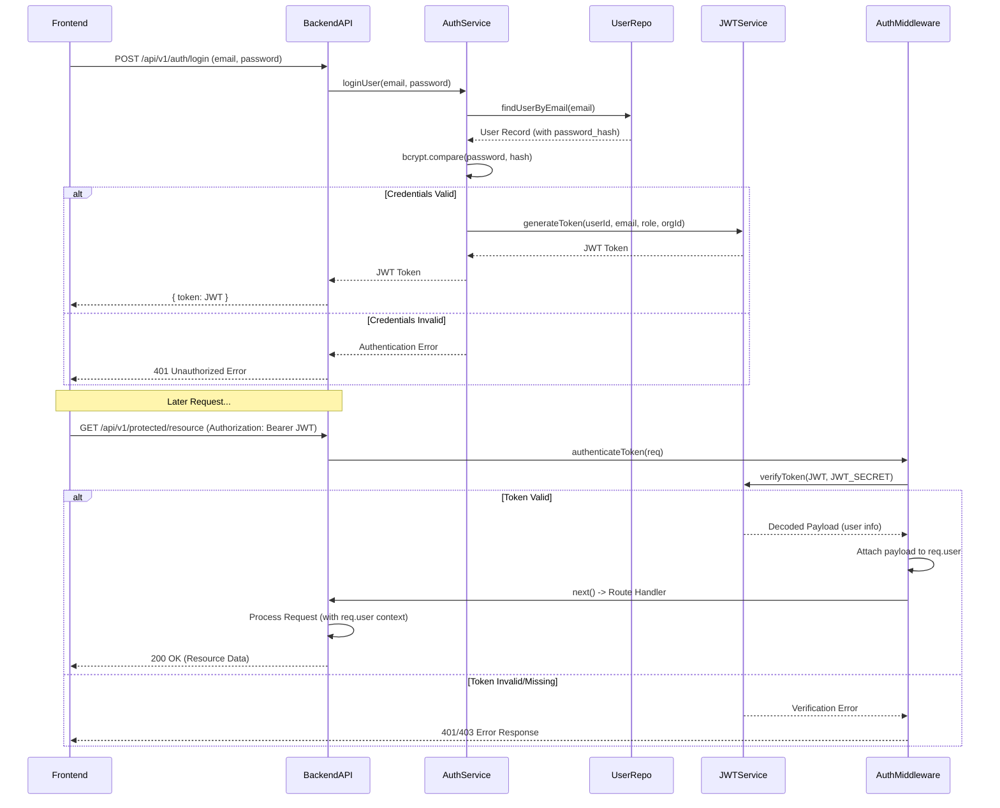

# Authentication & Authorization

## Overview

This document describes how the Credit Compliance Tool verifies the identity of users (Authentication) and controls their access to resources and actions (Authorization).

## Key Concepts

*   **Authentication:** The process of verifying a user's identity, typically through credentials like email and password.
*   **Authorization:** The process of determining if an authenticated user has the necessary permissions to perform a specific action or access a particular resource.
*   **JSON Web Tokens (JWT):** A standard method for securely transmitting information between parties as a JSON object. Used here to represent the authenticated user session.
*   **Password Hashing:** Storing user passwords securely by converting them into a non-reversible hash using algorithms like bcrypt.
*   **Roles:** Predefined levels of access (e.g., 'admin', 'reviewer' as seen in the `users` schema) assigned to users, which determine their permissions.

## Implementation

### Authentication

1.  **User Login:**
    *   A user submits credentials (likely email and password) via a frontend login form.
    *   The frontend sends these credentials to a backend API endpoint (e.g., `/api/v1/auth/login`).
    *   The backend service (`userService.ts` or a dedicated `authService.ts`) retrieves the user record from the database based on the email.
    *   It compares the provided password against the stored `password_hash` using `bcrypt.compare()`.
    *   If the credentials are valid, the backend generates a JWT.
2.  **JWT Generation:**
    *   The JWT payload includes essential user information like `userId`, `email`, `role`, and `organizationId`.
    *   The payload is signed using a secret key (`JWT_SECRET` environment variable) to ensure its integrity.
    *   The generated JWT is sent back to the frontend.
3.  **Session Management (Frontend):**
    *   The frontend typically stores the received JWT (e.g., in local storage, session storage, or memory).
    *   For subsequent requests to protected backend API endpoints, the frontend includes the JWT in the `Authorization` header using the `Bearer` scheme (e.g., `Authorization: Bearer <token>`).
4.  **Token Verification (Backend Middleware):**
    *   The `authenticateToken` middleware (`src/middleware/authMiddleware.ts`) intercepts requests to protected routes.
    *   It extracts the token from the `Authorization` header.
    *   It verifies the token's signature and expiration using `jwt.verify()` and the `JWT_SECRET`.
    *   If the token is valid, the decoded payload (containing user details) is attached to the `req.user` object.
    *   If the token is missing, invalid, or expired, the middleware sends a `401 Unauthorized` or `403 Forbidden` response, preventing access to the route handler.

### Authorization

*   **Role-Based Access Control (RBAC):** The primary mechanism for authorization appears to be based on the `role` field stored in the `users` table and included in the JWT payload.
*   **Enforcement:** Authorization checks likely occur within specific backend service methods or route handlers *after* the `authenticateToken` middleware has run.
    *   The code checks the `req.user.role` property.
    *   If the user's role does not permit the requested action (e.g., a 'reviewer' trying to perform an 'admin' action), the service/handler returns an error (e.g., `403 Forbidden`).
*   **Middleware (Potential):** While the provided `authMiddleware.ts` has commented-out code for role checking, dedicated authorization middleware could be implemented later to centralize permission checks for specific routes.

## Integration Points

*   **Frontend Login Form:** Collects user credentials.
*   **Backend Auth Routes (`src/routes/authRoutes.ts` - assumed):** Handle login requests.
*   **User Service/Repository (`userService.ts`, `userRepository.ts`):** Interact with the `users` table for credential verification.
*   **JWT Library (`jsonwebtoken`):** Used for generating and verifying tokens.
*   **Hashing Library (`bcrypt`):** Used for password hashing and comparison.
*   **Auth Middleware (`src/middleware/authMiddleware.ts`):** Verifies JWTs on incoming requests.
*   **Backend Services/Route Handlers:** Enforce role-based permissions based on `req.user.role`.

## Best Practices

*   **Strong JWT Secret:** Use a long, complex, and unpredictable string for `JWT_SECRET`, stored securely as an environment variable.
*   **Token Expiration:** Set reasonable expiration times for JWTs to limit the window of opportunity if a token is compromised. Consider implementing refresh tokens for longer sessions.
*   **HTTPS:** Always transmit tokens over HTTPS to prevent interception.
*   **Secure Password Storage:** Use a strong, adaptive hashing algorithm like bcrypt with a sufficient work factor. Never store plain-text passwords.
*   **Centralized Authorization Logic:** While currently likely in services/routes, consider centralizing role/permission checks (e.g., using middleware or dedicated authorization functions) as the application grows.
*   **Input Validation:** Validate all input, especially credentials, before processing.
