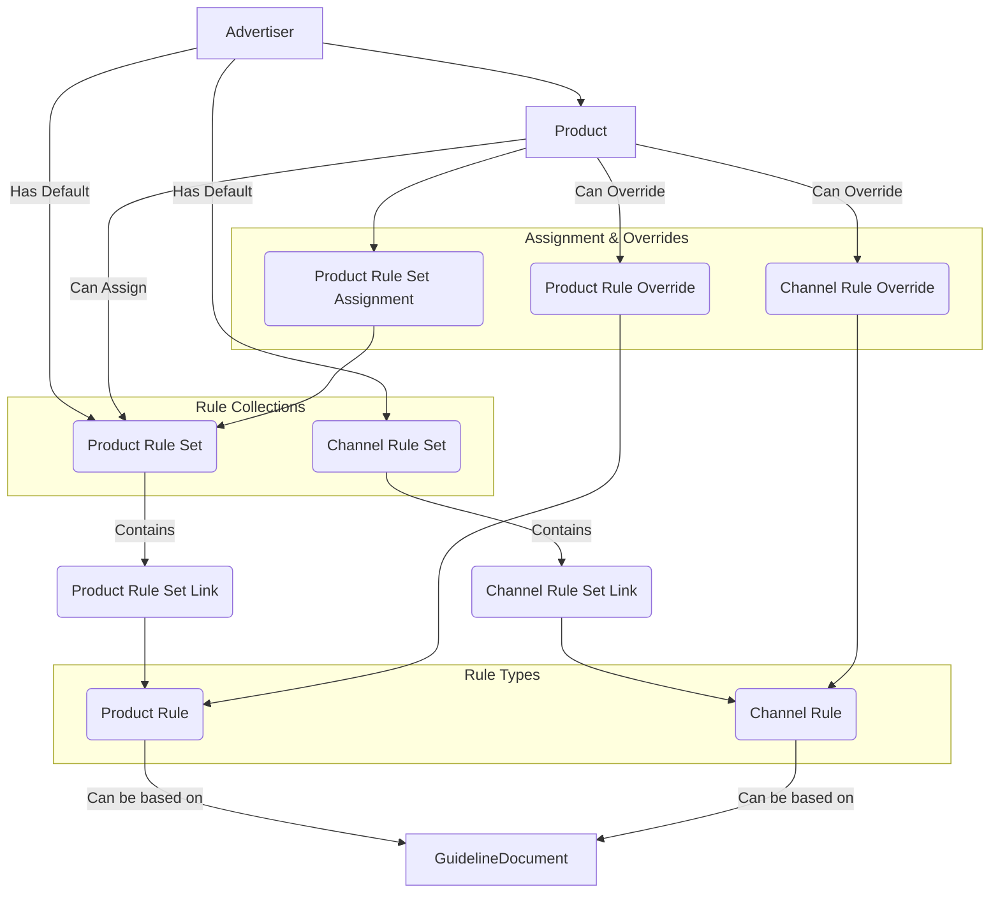

# Rule Engine

## Overview

The Rule Engine is responsible for defining, organizing, and managing the compliance rules against which scanned content is evaluated. It allows for granular control over which rules apply based on advertiser, product, and channel context.

## Key Concepts

*   **Advertiser:** The top-level entity, often representing the brand or company whose products are being promoted. Advertisers have default rule sets.
*   **Product:** Represents a specific product or service being advertised. Products belong to an Advertiser and can have specific rule sets assigned.
*   **Rule:** A specific compliance requirement. Rules are categorized into two main types:
    *   **Product Rules (`product_rules`):** Rules directly related to the advertised product itself (e.g., specific disclosures, feature descriptions).
    *   **Channel Rules (`channel_rules`):** Rules related to the platform or context where the content appears (e.g., platform-specific guidelines, general marketing practices, issuer requirements). Channel rules can be further scoped by `applicable_channel` (e.g., 'youtube') or `applicable_issuer`.
*   **Rule Type (`rule_type`):** Rules can be `document_based` (derived from uploaded guideline documents) or `manual` (defined directly via text).
*   **Guideline Documents (`guideline_documents`):** Source files (PDFs, DOCX, etc.) uploaded to the system that form the basis for `document_based` rules. Linked via `rule_id` and `rule_type`.
*   **Rule Set (`rule_sets`):** A named collection of either Product Rules or Channel Rules. Rule Sets belong to an Advertiser and have a `set_type` ('product' or 'channel'). Advertisers can have default product and channel rule sets.
*   **Rule Assignment:** Determines which rules apply to a specific piece of content. This is hierarchical:
    1.  **Product-Specific Assignment (`product_rule_set_assignments`):** A specific Product Rule Set can be directly assigned to a Product.
    2.  **Advertiser Default:** If a Product has no specific assignment, the Advertiser's default Product Rule Set is used.
    3.  **Channel Rules:** Channel rules are typically applied based on the Advertiser's default Channel Rule Set, potentially filtered by `applicable_channel` or `applicable_issuer`.
*   **Overrides:** Allow fine-grained control at the Product level:
    *   **Product Rule Overrides (`product_rule_overrides`):** Explicitly include or exclude specific `product_rules` for a given `product`.
    *   **Product Channel Rule Overrides (`product_channel_rule_overrides`):** Explicitly include or exclude specific `channel_rules` for a given `product`.

## Implementation

*   **Database:** The structure is defined in `docs/5-database/schema.sql`, involving tables like `advertisers`, `products`, `rule_sets`, `product_rules`, `channel_rules`, `product_rule_sets`, `channel_rule_sets`, `product_rule_set_assignments`, `product_rule_overrides`, `product_channel_rule_overrides`, and `guideline_documents`.
*   **Data Access:** Handled by repositories in `src/repositories/` (e.g., `ruleSetRepository.ts`, `productRuleRepository.ts`, `channelRuleRepository.ts`).
*   **Business Logic:** Managed by services in `src/services/` (e.g., `ruleSetService.ts`, `productRuleService.ts`, `channelRuleService.ts`). The logic for determining *which* rules apply to a specific `content_item` during analysis likely resides within the `aiAnalysisService.ts` or related services, considering the product(s) linked to the `scan_job`.

### Entity Relationships

## Integration Points

*   **AI Analysis:** The core consumer of the rule engine. The AI analysis process needs to determine the applicable set of Product Rules and Channel Rules for a given piece of content based on its associated product(s), publisher, and channel, considering assignments and overrides.
*   **Frontend:** The UI allows users to manage advertisers, products, rules, rule sets, assignments, and overrides.
*   **Guideline Document Upload:** A mechanism exists (likely via the API/Frontend) to upload documents that form the basis of `document_based` rules.

## Best Practices

*   **Clear Naming:** Use descriptive names for rules and rule sets.
*   **Granularity:** Define rules at an appropriate level of detail. Overly broad or narrow rules can be ineffective.
*   **Regular Review:** Periodically review and update rules and guideline documents to ensure they remain accurate and relevant.
*   **Testing:** Test rule application logic thoroughly, especially considering the hierarchy of defaults, assignments, and overrides.
