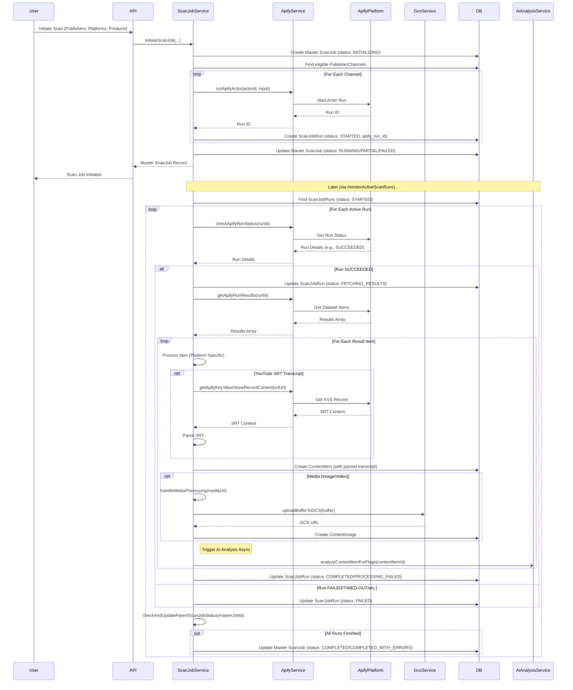
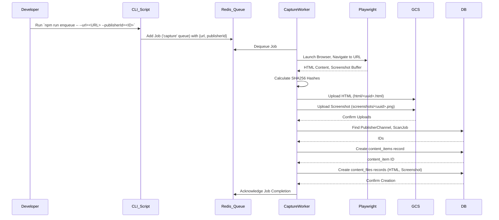

# Scanning Process

## Overview

The scanning process is the core mechanism by which the Credit Compliance Tool ingests content from external platforms (like Instagram, TikTok, YouTube) for compliance analysis. It involves initiating scan jobs, using external scraping services (Apify), processing the retrieved data, storing it, and triggering subsequent analysis steps.

## Key Concepts

*   **Scan Job (`scan_jobs`):** Represents a master task to scan specific publishers/channels/platforms. It tracks the overall status and links to individual runs.
*   **Scan Job Run (`scan_job_runs`):** Represents a specific execution of an external scraping task (e.g., an Apify actor run) for a single publisher channel. It tracks the status of the scraping task itself.
*   **Content Item (`content_items`):** Represents a single piece of content retrieved during a scan (e.g., a post, video). It stores metadata, text content (caption/description), and potentially a parsed transcript.
*   **Content Image (`content_images`):** Stores references to media files (images, videos) associated with a content item, typically hosted on Google Cloud Storage (GCS).
*   **Apify Integration:** The system leverages the Apify platform to perform the actual content scraping, using different "Actors" (pre-built scraping tools) for each supported platform.
*   **Asynchronous Processing:** Scan initiation, run monitoring, result processing, and AI analysis are handled asynchronously to manage potentially long-running tasks.

## Implementation

The primary logic for the scanning process resides in `src/services/scanJobService.ts`.

### Workflow

### Key Steps Explained

1.  **Initiation (`initiateScanJob`):**
    *   A master `scan_jobs` record is created.
    *   Eligible `publisher_channels` are identified based on input criteria.
    *   For each channel, the appropriate Apify Actor ID and input payload are determined based on the platform (Instagram, TikTok, YouTube).
    *   `apifyService.runApifyActor` is called to start the scraping task on Apify.
    *   A `scan_job_runs` record is created to track the specific Apify run, linking it to the master job and the channel.
    *   The master job status is updated based on whether runs were successfully triggered.

2.  **Monitoring (`monitorActiveScanRuns`):**
    *   Periodically queries the database for `scan_job_runs` records with status `STARTED`.
    *   Calls `processApifyRunCompletion` for each active run.

3.  **Run Completion Processing (`processApifyRunCompletion`):**
    *   Checks the actual status of the run on Apify using `apifyService.checkApifyRunStatus`.
    *   **If SUCCEEDED:**
        *   Fetches the results dataset using `apifyService.getApifyRunResults`.
        *   Iterates through each item in the dataset.
        *   **Platform-Specific Processing:** Extracts relevant data (caption, description, URLs, timestamps, media links, transcript info) based on the platform (Instagram, TikTok, YouTube).
        *   **Transcript Handling (YouTube):** If subtitle information is present, it attempts to fetch the SRT content (either directly from the result or via a KVS URL using `apifyService.getApifyKeyValueStoreRecordContent`), preprocesses it to handle formatting issues, parses it into structured data (start/end times, text), and stores it in the `content_items.transcript` field (as JSON).
        *   **Media Handling (`handleMediaProcessing`):** Downloads images/videos identified in the results, uploads them to GCS via `gcsService.uploadBufferToGCS`, and creates a `content_images` record linking the media to the `content_items` record.
        *   **Database Storage:** Creates a `content_items` record with the extracted and processed data.
        *   **AI Trigger:** Asynchronously calls `aiAnalysisService.analyzeContentItemForFlags` to initiate compliance analysis *after* the content item and its associated media (if any) have been processed and stored.
        *   Updates the `scan_job_runs` status to `COMPLETED` or `PROCESSING_FAILED`.
    *   **If FAILED/TIMED-OUT/ABORTED:** Updates the `scan_job_runs` status to `FAILED`.
    *   **Parent Job Update:** Calls `checkAndUpdateParentScanJobStatus` to see if the master job can be marked as complete.

4.  **Parent Job Completion (`checkAndUpdateParentScanJobStatus`):**
    *   Checks if all `scan_job_runs` associated with a master `scan_jobs` record are in a final state (`COMPLETED`, `FAILED`, etc.).
    *   If all runs are finished, updates the master `scan_jobs` status to `COMPLETED` or `COMPLETED_WITH_ERRORS` and sets the `end_time`.

## Integration Points

*   **Apify Service (`apifyService.ts`):** Handles all direct communication with the Apify API (starting runs, checking status, fetching results, accessing KVS).
*   **GCS Service (`gcsService.ts`):** Handles uploading media files to Google Cloud Storage.
*   **Database:** Stores all job, run, content, and media metadata via Prisma.
*   **AI Analysis Service (`aiAnalysisService.ts`):** Triggered after content processing to perform compliance checks.

## Best Practices

*   **Configuration:** Apify Actor IDs and potentially other platform-specific settings should be configurable rather than hardcoded where possible.
*   **Error Handling:** Robust error handling is crucial at each step (API calls, data processing, database writes) to prevent job failures and ensure accurate status tracking. Failed items within a run should be logged clearly.
*   **Monitoring:** Continuous monitoring of active runs is essential to process results promptly. Consider backoff strategies for API calls.
*   **Scalability:** Triggering AI analysis asynchronously helps decouple it from the main processing loop. Consider using a message queue for more robust handling of AI tasks, especially under high load.

## Apify Scan Limits

When initiating scans via the main application (e.g., through the dashboard "New Scan Job" button), the number of content items fetched per channel from Apify is controlled within the `initiateScanJob` function in `src/services/scanJobService.ts`.

The specific parameters used depend on the platform:

*   **Instagram:** `resultsLimit` (Actor: `apify/instagram-scraper`)
*   **TikTok:** `resultsPerPage` (Actor: `clockworks/free-tiktok-scraper`)
*   **YouTube (Videos):** `maxResults` (Actor: `streamers/youtube-scraper`)
*   **YouTube (Shorts):** `maxResultsShorts` (Actor: `streamers/youtube-scraper`)

As of May 2nd, 2025, these limits are hardcoded to `3` in the aforementioned file.

**Note:** Temporary scripts in the `/temp-scripts` directory (e.g., `triggerBulkScans.ts`) may use different limits or parameter names when initiating scans manually. Scans triggered via the application UI use the limits defined in `src/services/scanJobService.ts`.

## Website Scanning (Sprint 0 Foundation)

In addition to scanning social media platforms via Apify, the system includes a foundational capability for scanning standard websites directly. This was introduced in Sprint 0.

### Workflow (Sprint 0)

### Key Components (Sprint 0)

*   **Manual Trigger:** Scanning is initiated manually by a developer using the `temp-scripts/enqueueWebsiteUrl.ts` script (run via `npm run enqueue`). This script requires the target URL and the associated `publisherId`.
*   **Queue:** A dedicated BullMQ queue named `capture` is used, managed via Redis (`REDIS_URL`).
*   **Worker:** The `src/workers/captureWorker.ts` process listens to the `capture` queue.
*   **Scraping:** The worker uses Playwright (specifically Chromium) to navigate to the provided URL, wait for the page to load (`networkidle`), and capture the full HTML content and a full-page PNG screenshot.
*   **Storage:**
    *   Raw HTML is stored in GCS under the `html/` prefix (e.g., `html/<uuid>.html`).
    *   Screenshots are stored in GCS under the `screenshots/` prefix (e.g., `screenshots/<uuid>.png`).
*   **Database:**
    *   A `content_items` record is created for the scanned page, linking it to the provided `publisherId`, a relevant `publisher_channel_id` (looked up based on publisherId and platform='website'), and a generic `scan_job_id` (e.g., 'Manual Website Scan'). The `platform` is set to 'website'.
    *   Two `content_files` records are created, linked to the `content_items` record: one for the HTML and one for the screenshot. These records store the `fileType`, GCS `filePath`, and the calculated `sha256` hash.
*   **Hashing:** SHA-256 hashes are calculated for both the HTML and screenshot content using `src/utils/hashUtil.ts` and stored in the `content_files` records.
*   **Image Capture (Initial):** Initially, the worker captured *all* `` tags found on the page after filtering by domain and size limits. This could lead to capturing many unnecessary images (logos, icons, ads).

### Configuration (Post-Sprint 2)

To provide more control over website scanning, channel-specific configurations can be managed via the Admin UI (Publisher Management -> Edit Channel -> Configure). Key configuration options stored in `publisher_channel_configs` include:

*   **Sitemap URL:** Optional URL to an XML sitemap for URL discovery.
*   **Login Credentials Secret ID:** Reference to credentials stored in Secret Manager for sites requiring login.
*   **Include Domains:** List of domains the crawler is allowed to visit.
*   **Exclude Patterns:** URL patterns (simple wildcards supported) to exclude.
*   **Max Pages:** Limit on the number of pages to crawl.
*   **Max Depth:** Limit on the crawl depth (link distance from the start page).
*   **Image Max Bytes:** Maximum size for downloaded image files.
*   **Hero Image Selector (Optional):** A CSS selector to specifically target hero image(s) on a page. Example: `.hero img`, `#main-image`.
*   **Article Content Selector (Optional):** A CSS selector for the main container element holding article text and associated images. Example: `.article-body`, `#content`.

**Image Extraction Logic (with Selectors):**

*   If `heroImageSelector` is provided, only images matching this selector are considered hero images.
*   If `articleContentSelector` is provided, only `` tags found *within* the element matching this selector are considered article images.
*   If *both* are provided, images matching either selector are extracted.
*   If *neither* selector is provided, **no images** are extracted from the page content (the full-page screenshot is still captured). This encourages specific configuration to avoid capturing excessive unwanted images.
*   See [Finding CSS Selectors](./finding-css-selectors.md) for a guide on how to identify appropriate selectors for a website.

### Future Enhancements

This implementation provides the core capture mechanism. Future sprints may build upon this foundation by adding:

*   Automatic URL discovery (e.g., sitemap parsing, link crawling).
*   Handling for website logins.
*   Integration with the Admin UI for managing website channels and triggering scans.
*   Triggering AI analysis on the captured HTML content.
