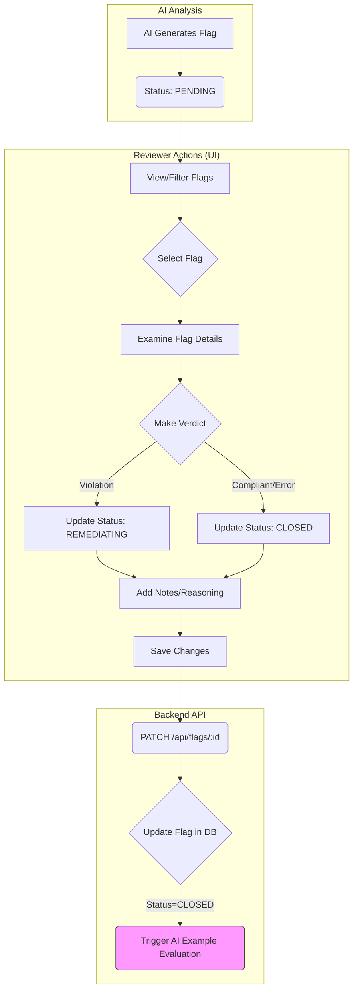

# Feature: Flag Review Workflow

## Overview

The Flag Review Workflow allows human reviewers to examine the compliance flags generated by the AI Analysis feature, provide their expert judgment, and manage the lifecycle of each flag until resolution.

## Key Concepts

*   **Flag (`flags` table):** The central object of the workflow, representing a potential compliance issue or confirmation identified by the AI.
*   **Flag Status (`flags.status`):** Tracks the current stage of a flag in the review process. Common statuses likely include:
    *   `PENDING`: Newly generated by the AI, awaiting review.
    *   `IN_REVIEW`: Actively being examined by a reviewer.
    *   `REMEDIATING`: A violation has been confirmed, and action is being taken (e.g., contacting the publisher).
    *   `CLOSED`: The flag has been resolved (either confirmed compliant, confirmed violation and remediated, or deemed a false positive).
*   **Human Verdict (`flags.human_verdict`):** The reviewer's final assessment (`VIOLATION`, `COMPLIANT`, `ERROR`).
*   **Reviewer (`flags.reviewer_id`):** The user who performed the review and made the final verdict.
*   **Reasoning/Notes:** Fields for reviewers to add context (`human_verdict_reasoning`, `internal_notes`) and potentially provide feedback on the AI's performance (`ai_feedback_notes`).
*   **AI Learning Example Selection:** When a flag is closed, the system automatically evaluates it as a potential example for future AI training or fine-tuning (`aiExampleManagerService.evaluateAndSelectExample`).

## Implementation

### Workflow Steps (User Perspective)

1.  **Flag Discovery:** Reviewers access flags via the frontend UI (Flag Review page). This involves:
    *   A table listing flags.
    *   Filtering capabilities (`GET /api/flags` with query parameters) to find flags based on:
        *   **Scan Job:** Only shows jobs with currently active (non-CLOSED) flags. Uses the `has_active_flags` field on the `scan_jobs` table.
        *   **Publisher:** Filters by the publisher associated with the flag's content item.
        *   **Product:** Filters by the product directly linked to the flag (if any).
        *   **Status:** Filters by flag status (e.g., 'New', 'In Review', 'Pending Remediation', 'Closed').
        *   **Platform:** Filters by the platform of the content item (e.g., 'YouTube Video', 'TikTok'). Uses a hardcoded list of platforms defined in `ConnectedFlagReviewContent.tsx`. *Note: If new platforms are added to the system, this list needs manual updating.*
        *   **Rule:** Filters by the specific rule ID associated with the flag. (UI for this might still be pending).
        *   **Date Range:** Filters flags based on their creation date.
        *   *(Other potential filters like AI Ruling, Human Verdict, etc. are supported by the API but might not have UI elements yet)*.
2.  **Flag Examination:** The reviewer selects a flag to examine. The UI displays:
    *   The content item details (link, caption, transcript).
    *   The specific rule that was flagged.
    *   The AI's ruling, confidence, reasoning, and the context snippet.
    *   Any associated media (images/video).
    *   **Screenshot Button (Conditional):** If the flag is for YouTube/YouTube Shorts content (`content_items.platform`) AND has a specific timestamp (`flags.transcript_start_ms`), a "Capture Screenshot @ [time]" button appears. Clicking this triggers a backend process (`POST /api/screenshots`) to capture the video frame at that exact time using Playwright, store it in GCS, and link the resulting `content_images` record ID to the flag's `image_reference_id`.
3.  **Review & Verdict:** The reviewer analyzes the information (including any captured screenshot) and determines the actual compliance status.
4.  **Update Flag:** The reviewer updates the flag via the UI:
    *   Sets the `human_verdict` (`VIOLATION`, `COMPLIANT`, `ERROR`).
    *   Adds reasoning (`human_verdict_reasoning`) and any internal notes (`internal_notes`).
    *   Provides feedback on the AI's accuracy (`ai_feedback_notes`).
    *   Updates the `status` (e.g., to `REMEDIATING` if a violation requires action, or `CLOSED` if resolved).
    *   The frontend calls the `PATCH /api/flags/:flagId` endpoint with the updated data.
5.  **Resolution:** Flags eventually reach the `CLOSED` status once reviewed and any necessary remediation is complete.

### Backend Support

*   **API Endpoints (`src/routes/flagRoutes.ts`):**
    *   `GET /api/flags`: Provides filtered lists of flags for the UI.
    *   `PATCH /api/flags/:flagId`: Allows updating flag status, verdict, and notes. Assigns the logged-in user as the `reviewer_id`.
*   **Repositories (`flagRepository.ts`):** Handles database interactions for finding and updating flags.
*   **Services (`aiExampleManagerService.ts`):** Evaluates closed flags as potential training examples for the AI.

## Integration Points

*   **AI Compliance Analysis:** Generates the initial flags that feed into this workflow.
*   **Database (`flags` table):** Stores the state and details of each flag throughout its lifecycle.
*   **API Routes (`flagRoutes.ts`, `screenshotRoutes.ts`):** Provide the interface for the frontend to interact with flags and trigger screenshots.
*   **Frontend UI:** Presents flags to reviewers, allows them to update status/verdicts, and displays/triggers the screenshot button when applicable.
*   **AI Example Manager Service:** Consumes closed flags to potentially improve future AI performance.
*   **Screenshot Service (`screenshotService.ts`):** Handles the backend logic for capturing screenshots using Playwright.
*   **GCS Service (`gcsService.ts`):** Handles uploading screenshots to Google Cloud Storage.
*   **Authentication/Authorization:** Ensures only authenticated users can review flags and trigger screenshots, potentially restricting access based on roles or assignments.

## Best Practices

*   **Clear UI:** Provide a clear and efficient interface for reviewers to view flag details, context, and update status/verdicts.
*   **Filtering/Sorting:** Robust filtering and sorting options are essential for managing large numbers of flags.
*   **Audit Trail:** The `updated_at` timestamp and `reviewer_id` provide a basic audit trail. Consider adding a more detailed history log for flag status changes if required.
*   **Feedback Loop:** Encourage reviewers to provide feedback on AI accuracy (`ai_feedback_notes`) to help improve the system.
    *   **Status Definitions:** Ensure clear definitions and consistent use of different `FlagStatus` values.

### Publisher Communication (Comments)

A key part of the flag review workflow is the ability for reviewers/admins to communicate with publishers regarding specific flags. This is handled via a comment thread associated with each flag.

**Recent Enhancements & Fixes (May 2025):**

1.  **Initial Comment Loading:**
    *   **Fix:** Comments are now correctly loaded and displayed when a flag is first selected in the review interface. Previously, comments might only appear after a new one was added.
    *   **Implementation:** The backend repository (`src/repositories/flagRepository.ts`) was updated to include comments (and associated user details) when fetching the list of flags for the review table.

2.  **Comment Display & UI:**
    *   **Readability:** The styling for reviewer/admin comment bubbles in the UI (`frontend/src/components/flagReview/EnhancedFlagPreview.tsx`) has been updated for better contrast and readability (e.g., light blue background with darker blue text).
    *   **Username Display:** Usernames are now correctly displayed for each comment. This involved ensuring proper data mapping from the backend (where user info is nested) to the frontend's expected `user_name` field.
    *   **Alignment:** The comment metadata (username, role, timestamp, and delete button) is now correctly aligned (right-aligned for reviewer/admin comments, left-aligned for publisher comments) underneath the respective comment bubble.
    *   **Delete Button Size:** The delete button icon has been made larger and its clickable area increased for better usability.

3.  **Delete Comment Functionality:**
    *   **Feature:** Reviewers/admins can now delete comments.
    *   **UI:** A delete icon (trash can) appears next to each comment.
        *   **Visibility:** The button is visible to users with the 'ADMIN' role or to the user who authored the comment.
        *   **Confirmation:** Clicking the delete button prompts the user for confirmation before proceeding.
    *   **Implementation:**
        *   **Frontend:** Handled in `EnhancedFlagPreview.tsx` and `flagService.ts` (frontend).
        *   **Backend:** A new `DELETE /api/flags/:flagId/comments/:commentId` endpoint was added (`src/routes/flagRoutes.ts`), along with corresponding controller (`src/controllers/flagController.ts`) and service (`src/services/flagService.ts`) methods to handle the deletion and authorization (admins can delete any, authors can delete their own).

4.  **Backend API for Flag Details:**
    *   **Fix:** A dedicated backend route `GET /api/flags/:flagId` was implemented to correctly fetch details for a single flag, including its comments. This resolved an issue where refreshing flag details after adding a comment could fail.

### "Your Verdict" Section Structure

As of the latest updates, the "Your Verdict" section in the `EnhancedFlagPreview.tsx` component allows reviewers to:

*   **Select Verdict:** Choose between "Violation" or "Compliant" using dedicated buttons.
*   **Provide AI Feedback:** Enter text into a "Feedback on AI Ruling - Used for Learning" textarea.
*   **Add Internal Comments:** Use a "Comments - Internal Use Only" textarea for notes not visible to publishers.
*   **Severity (Removed):** A "Severity" dropdown was previously part of this section but has since been removed.

The submission of this verdict updates the flag's status, human verdict, and associated notes via the `PATCH /api/flags/:flagId` endpoint.

### Publisher Flag Management

Publishers interact with flags primarily through the `/publisher/flags` page.

**Main List View (`PublisherFlagsPage.tsx`):**
*   Displays a list of flags requiring remediation.
*   Each list item provides a summary:
    *   Rule Name (summary or citation)
    *   URL to the content
    *   Product Name
    *   Context Snippet
*   Actions available directly on the list item:
    *   "Mark Remediated" button.
    *   "View Details" button, which opens the detailed preview modal.
*   **Note:** This list view is simplified and does not show full rule text or comments.

**Detailed Flag Preview Modal (`PublisherFlagPreview.tsx`):**
This modal is opened via the "View Details" button.

To provide publishers with a comprehensive understanding of flags relevant to their content, a detailed flag preview modal has been implemented on the `/publisher/flags` page.

**Accessing the Detailed Preview:**
Publishers can access this detailed view by clicking the "View Details" button associated with a flag in their list. This action opens a modal dialog displaying the `PublisherFlagPreview.tsx` component.

**Information Displayed to Publishers:**
The modal is tailored to provide publishers with actionable information while omitting internal review details. It includes:

*   **Flagged Content Media:** Displays the actual media (e.g., YouTube video embed, TikTok/Instagram video/image fetched from GCS). For GCS media, the system uses the `id` from the `content_images` record (the primary key) to fetch and display the content.
*   **Full Description/Caption:** The complete caption or description associated with the content item.
*   **Excerpt/Context Snippet:** The specific text segment that triggered the AI flag.
*   **Link to Original Content:** A direct URL to view the content on its original platform.
*   **Product Information:** The name of the product associated with the flag.
*   **Rule Violation Details:**
    *   The name of the rule that was violated.
    *   The detailed description or manual text of the rule.
*   **Violation Analysis:** The AI's reasoning for why the content was flagged (note: the AI's direct verdict like "VIOLATION" and its confidence score are not shown to the publisher).
*   **Communication Log:**
    *   A threaded view of messages exchanged between the review team and the publisher regarding this specific flag.
    *   An input field allowing the publisher to send new messages to the review team.
*   **Actions:**
    *   A "Mark as Remediated" button is available at the bottom of the modal, allowing the publisher to mark the flag as remediated directly from this detailed view.

**Key Exclusions for Publishers:**
The publisher's detailed view intentionally omits internal review functionalities such as:
*   Verdict submission controls (Violation/Compliant buttons).
*   Internal comments and AI feedback fields.
*   The "Capture Screenshot" button.
*   The ability for publishers to delete comments (they can only add their own).
