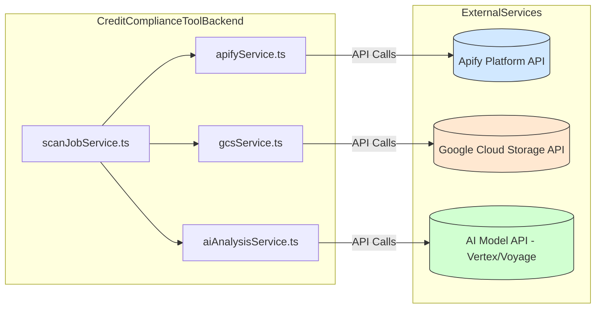

# External Service Integrations

## Overview

The Credit Compliance Tool integrates with several external cloud services to perform key functions like content scraping, media storage, and AI analysis.

## Apify (Content Scraping)

*   **Purpose:** Used to scrape content from various social media platforms (Instagram, TikTok, YouTube).
*   **Integration:**
    *   The backend interacts with the Apify API via the `apify-client` library.
    *   The `src/services/apifyService.ts` likely encapsulates all Apify API interactions.
    *   Specific Apify "Actors" (pre-built scrapers) are invoked for each platform (e.g., `apify/instagram-scraper`, `clockworks/free-tiktok-scraper`, `streamers/youtube-scraper`). Actor IDs might be hardcoded or configurable.
    *   The `scanJobService.ts` triggers Apify actor runs, monitors their status, fetches results datasets, and potentially retrieves specific files (like SRT transcripts) from Apify's Key-Value Store (KVS).
*   **Configuration:** Requires an Apify API token, likely configured via the `APIFY_API_TOKEN` environment variable.

## Google Cloud Storage (GCS) (Media Storage)

*   **Purpose:** Used to store binary media files (images, videos) associated with scanned content items. Storing these files externally keeps the primary database lean.
*   **Integration:**
    *   The backend interacts with GCS using the `@google-cloud/storage` library.
    *   The `src/services/gcsService.ts` likely handles uploading files (downloaded from Apify or other sources) to a designated GCS bucket.
    *   Functions like `uploadBufferToGCS` take a file buffer and destination path and return the public GCS URL of the uploaded object.
    *   The `content_images` table in the database stores these GCS URLs (`file_path`) rather than the files themselves.
*   **Configuration:** Requires Google Cloud credentials configured for the environment where the backend runs. This is often handled via Application Default Credentials (ADC), potentially using a service account key file specified by the `GOOGLE_APPLICATION_CREDENTIALS` environment variable. A specific GCS bucket name is also required.

## AI Model Service (Compliance Analysis)

*   **Purpose:** Performs the core compliance analysis by evaluating content against rules using a large language model (LLM).
*   **Integration:**
    *   The backend interacts with the AI service provider's API. Based on dependencies (`@google-cloud/vertexai`, `@google/generative-ai`) and code comments, this is likely **Google Cloud Vertex AI** using **Gemini** models (e.g., `gemini-2.0-flash` mentioned in `aiAnalysisService.ts`).
    *   *(User Requirement Discrepancy: The initial request specified using **Voyage AI**'s "Voyage 3 large" model with 1024 dimensions. The documentation should reflect the actual implementation, but this difference needs clarification.)*
    *   The `src/services/aiAnalysisService.ts` (and potentially `aiAnalysisServiceParallel.ts`, `aiCallWrapperService.ts`) handles constructing prompts, sending requests to the AI model API, and parsing the structured responses to generate flags.
    *   It utilizes function calling capabilities (`get_relevant_examples` tool) to interact with the `aiLibrarianService`.
*   **Configuration:** Requires API keys or credentials for the chosen AI service provider (Google Cloud Vertex AI or Voyage AI). For Google Cloud, this is likely handled via ADC similar to GCS. Specific model names (e.g., `gemini-2.0-flash` or `voyage-3-large-1024`) need to be configured.

## Integration Diagram

## Best Practices

*   **Configuration:** Store API keys, bucket names, model names, and other integration parameters securely in environment variables, not hardcoded.
*   **Error Handling:** Implement robust error handling and retry mechanisms for calls to external services, as network issues or service downtime can occur.
*   **Abstraction:** Keep service-specific interaction logic encapsulated within dedicated service files (e.g., `apifyService.ts`, `gcsService.ts`).
*   **Monitoring:** Monitor the usage, cost, and performance of external API calls. Log relevant information about requests and responses.
*   **Security:** Ensure credentials are handled securely and permissions are scoped appropriately (e.g., service accounts with least privilege).
