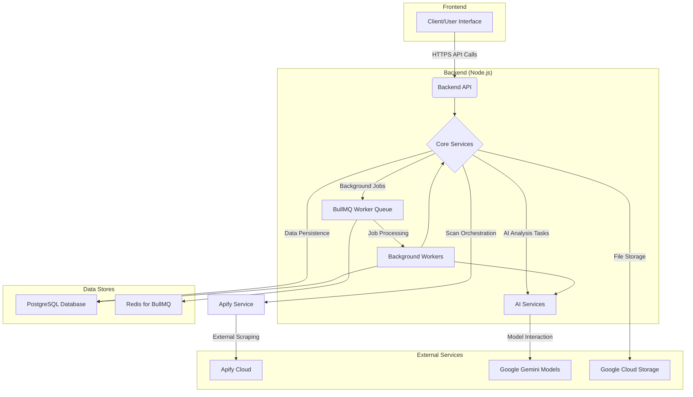

# Credit Compliance Tool: Investor Study Guide (v2025-05-20)

## I. Project Overview & Business Value

*   **Problem:** Manually reviewing online marketing content (social media, videos) for compliance with complex, product-specific, and platform-specific rules is a significant challenge. It's time-consuming, prone to human error, and difficult to scale, especially for organizations working with numerous publishers or influencers.
*   **Solution:** The Credit Compliance Tool automates and streamlines this critical process. It scans online content, leverages Artificial Intelligence (AI) to analyze it against relevant compliance rules, flags potential violations, and provides an integrated workflow for human review and remediation.
*   **Key Goal:** To empower organizations to achieve comprehensive compliance coverage efficiently and accurately, reducing risk and manual effort.
*   **Target Users:** Compliance teams, legal departments, and marketing managers within organizations that partner with publishers, influencers, or other third-party marketers.

## II. Core System Architecture

The Credit Compliance Tool is built on a modern, scalable technology stack designed for robustness and maintainability.

*   **Frontend:** **Next.js (App Router)**
    *   *Why:* A leading React framework enabling the development of rich, interactive user interfaces. The App Router architecture facilitates server components for improved performance, better data fetching strategies, and enhanced code organization.
*   **Backend API:** **Node.js with Express.js**
    *   *Why:* Node.js's non-blocking, event-driven architecture is highly efficient for I/O-intensive operations common in API backends (database interactions, calls to external services). Express.js provides a minimal and flexible foundation for building robust APIs. The vast JavaScript/TypeScript ecosystem is also a significant advantage.
*   **Database:** **PostgreSQL with Prisma ORM**
    *   *Why:* PostgreSQL is a powerful, open-source relational database renowned for its reliability, data integrity, and ability to handle complex queries and large datasets. Prisma ORM enhances developer productivity and data safety with its type-safe client and intuitive schema management.
*   **AI Models:** **Google Gemini (Flash & Pro variants)**
    *   *Why:* State-of-the-art multimodal AI models from Google. Key advantages include strong function-calling capabilities (essential for the "AI Librarian"), a balance of performance and cost across different model variants (e.g., Flash for speed, Pro for complex reasoning), and future potential for deeper multimodal analysis.
*   **Background Job Processing:** **BullMQ with Redis**
    *   *Why:* Essential for managing long-running tasks (like AI analysis, post-processing) without blocking the API. BullMQ is a robust Node.js queue system backed by Redis, ensuring reliable job handling, decoupling of services, and scalability of worker processes.
*   **Content Scraping:** **Apify**
    *   *Why:* A specialized third-party cloud platform for web scraping. It offloads the complexity of building and maintaining scrapers for diverse and dynamic platforms (YouTube, TikTok, Instagram), handling anti-scraping measures, and ensuring scalability.
*   **File Storage:** **Google Cloud Storage (GCS)**
    *   *Why:* A scalable, durable, and cost-effective solution for storing binary data like scraped media (images, videos), screenshots, and potentially other large files.
*   **Containerization:** **Docker & Docker Compose**
    *   *Why:* Docker standardizes the application environment by packaging services and their dependencies into containers. This ensures consistency from development to production. Docker Compose simplifies the local setup of multi-container applications (backend, frontend, database, Redis), boosting developer productivity.

## III. Key Features & How They Work (Technical Breakdown)

### A. Content Ingestion & Scraping

This phase focuses on acquiring content from various online platforms for compliance analysis.

1.  **Scan Initiation:**
    *   Users can initiate scan jobs targeting specific publisher channels or broader criteria (multiple publishers, platforms, and products) via the API (`/api/scan-jobs/...`).
    *   The `scanJobService.ts` creates a master `scan_jobs` record in the database.

2.  **Multi-Platform Scraping with Apify:**
    *   The `scanJobService.ts` identifies eligible publisher channels based on the job criteria.
    *   For each channel, it prepares platform-specific input parameters for the relevant Apify Actor (e.g., `apify/instagram-scraper`, `clockworks/free-tiktok-scraper`, `streamers/youtube-scraper`). These Actor IDs are currently hardcoded in `scanJobService.ts` but could be made configurable.
    *   `apifyService.ts` is invoked to start the Apify Actor run in the Apify cloud. Each run is tracked via a `scan_job_runs` database record.
    *   *Rationale for Apify:* Chosen for its pre-built scrapers, reliability in handling diverse and frequently changing platforms, scalability, and to reduce the in-house development and maintenance burden associated with web scraping.

3.  **Apify Run Monitoring & Result Processing:**
    *   A background process, `scanJobService.monitorActiveScanRuns` (likely invoked periodically), polls Apify for the status of ongoing runs.
    *   When an Apify run `SUCCEEDS`, `scanJobService.processApifyRunCompletion` is triggered:
        *   **Data Fetching:** Results are retrieved from the Apify dataset. For YouTube/Shorts, SRT transcript files are fetched from Apify's Key-Value Store using `apifyService.getApifyKeyValueStoreRecordContent`.
        *   **Platform-Specific Parsing:** The raw data from Apify is parsed based on the platform. This includes extracting titles, captions/descriptions, and processing SRT files into a structured JSON format for transcripts. This logic is intricate, especially the SRT normalization and parsing to handle various formats and potential errors.
        *   **Database Storage:** The processed textual and metadata are stored as `content_items` records.
        *   **Media Handling:** Associated media (images, videos) are downloaded from their URLs (provided by Apify) using `axios`. These files are then hashed (SHA256), uploaded to Google Cloud Storage (GCS) by `gcsService.ts`, and their GCS URIs are stored in the `content_images` table, linked to the `content_item`.
    *   This structured `content_item` (with its text and links to media in GCS) becomes the primary input for the subsequent AI analysis stages.

4.  **Foundational Playwright Crawler:**
    *   An earlier, in-house crawler using Playwright (`src/workers/captureWorker.ts`) exists. It's designed to capture HTML and full-page screenshots of general websites and uses BullMQ for queuing these capture jobs. This may serve specific use cases or as a precursor to the broader Apify integration.

### B. AI-Powered Compliance Analysis (Two-Stage Process)

The system employs a sophisticated two-stage AI process to analyze content for compliance violations, primarily orchestrated by `aiAnalysisServiceParallel.ts` and `flagExtractionService.ts`.

1.  **Stage 1: Multimodal Mention Extraction (`flagExtractionService.ts`)**
    *   **Purpose:** To intelligently identify and extract all *potential* compliance-related "mentions" from the diverse content. This includes product names, fee disclosures, specific marketing claims, and relevant visual or audio cues.
    *   **Input:** A `content_item` (containing title, caption, transcript) and its associated `content_images` (which are references to media stored in GCS).
    *   **Process:**
        *   A detailed prompt is constructed for a Gemini model (e.g., `gemini-1.5-flash-preview-04-17`).
        *   This prompt includes the textual content and, critically, GCS URIs for the associated images and videos, enabling the AI to perform multimodal analysis.
        *   The AI is instructed to act as a specialized "extractor," identifying mentions related to predefined categories (product names, annual fees, marketing bullets) and providing detailed context for each.
        *   This includes the exact `contextText`, `sourceLocation` (e.g., TITLE, IMAGE\_VISUAL, TRANSCRIPT), `surroundingContext`, `visualLocation` (for media), and `timestampStartMs`/`timestampEndMs` (for transcripts/audio).
    *   **Output:** An array of `ExtractedMention` objects. Each object includes the extracted information and an "extractor confidence score" indicating the AI's confidence in that specific extraction. The prompt provides a detailed rubric for this confidence scoring, aiming for conservative and well-calibrated scores.
    *   *Rationale for this stage:* This pre-processing step narrows down the vast amount of content into a manageable set of specific, context-rich mentions. It leverages multimodal AI to catch information that might be missed by text-only analysis. This allows the subsequent evaluation stage to be more focused and efficient.

2.  **Stage 2: Focused Mention Evaluation (`aiAnalysisServiceParallel.ts`)**
    *   **Purpose:** To evaluate each `ExtractedMention` (identified in Stage 1) against the relevant set of compliance rules.
    *   **Input:** An `ExtractedMention` object and the overall context of the `content_item`.
    *   **Rule Application:** The service determines the applicable product-specific or global advertiser rules. A key aspect is that only rules *directly relevant to the `mentionType`* of the `ExtractedMention` are considered for evaluation.
    *   **Process:**
        *   For each `ExtractedMention`, a new, highly focused prompt is generated for a Gemini model.
        *   This prompt includes the detailed `ExtractedMention` data, the specific rules to be evaluated against that mention, and instructions to adjust the final confidence score starting from the "extractor confidence" generated in Stage 1.
        *   **The "AI Librarian" - Intelligent Tool Use:** During this evaluation, if the AI's confidence is low (e.g., below 0.70), it can invoke the `get_relevant_examples` tool.
            *   This triggers `aiLibrarianService.ts`, which fetches relevant, previously human-reviewed flag examples from the database.
            *   Another AI call is made by the librarian service to *rank* these examples based on their relevance to the current problematic mention.
            *   The top-ranked examples are returned to the evaluating AI, providing it with valuable context to improve its decision-making.
            *   *Rationale for AI Librarian & Function Calling:* This provides a dynamic way for the AI to seek help on ambiguous cases, improving accuracy. Using the LLM's native function calling is a direct and efficient way to integrate this capability without the overhead of a full A2A SDK for this specific, internal tool use.
    *   **Output:** The AI's structured response is parsed, and `flags` records are created in the database. Each flag includes the AI's ruling (compliant/violation), final confidence score, detailed reasoning, and links back to the `content_item`, `product` (if applicable), and the specific rule.
    *   *Rationale for this stage:* This focused evaluation of pre-identified mentions allows for more precise and accurate compliance checking. The two-stage process (Extract then Evaluate) enhances modularity and allows for potentially different AI models or configurations to be used for each specialized task.

### C. Automated Flag Disposition (AI Bypass Workflow)

This feature aims to reduce manual review effort by automatically actioning flags where the AI has high confidence.

1.  **Trigger:** After a master scan job and its initial AI analyses are complete, `scanJobService.ts` adds a job to the `aiBypassQueue` (a BullMQ queue).
2.  **Processing (`aiBypassProcessor.ts` Worker):**
    *   The worker retrieves the `scan_job_id`.
    *   It checks if AI processing was explicitly bypassed for the entire job (via `scan_jobs.bypass_ai_processing`); if so, it skips.
    *   It fetches the organization's AI bypass settings (confidence threshold, auto-approve compliant flags, auto-remediate violation flags) via `organizationService.ts`.
    *   It processes `PENDING` flags associated with the scan job.
    *   If a flag's `ai_confidence` score is *above* the organization's threshold:
        *   If the AI ruling was "compliant" and auto-approval is enabled, the flag status is set to `CLOSED`, and `resolution_method` to `AI_AUTO_CLOSE`.
        *   If the AI ruling was "violation" and auto-remediation is enabled, the flag status is set to `REMEDIATING`, and `resolution_method` to `AI_AUTO_REMEDIATE`.
        *   An audit log is created for each automatically actioned flag.
3.  **Benefit:** This automates the handling of clear-cut cases identified by the AI, allowing human reviewers to focus on more ambiguous or complex flags. Note that this is a *post-analysis* step; it acts on flags already generated by the AI.

### D. User Management & Workflow

*   **Authentication:** A standard JWT (JSON Web Token) based system (`authRoutes.ts`, `authMiddleware.ts`) is used. Users register and log in to receive a token, which is then used to authenticate subsequent API requests. The token includes user ID, email, role, organization ID, and publisher ID (if applicable).
*   **Authorization:** Role-based access control is implemented by checking the `req.user.role` (extracted from the JWT by `authMiddleware.ts`) within service functions or route handlers to determine if a user has permission to perform certain actions.
*   **Flag Review & Remediation:** The system supports a workflow where flags are initially `PENDING`. Human reviewers can then examine these flags, update their status (e.g., to `REMEDIATING` or `CLOSED`), add comments, and assign a `human_verdict`.
*   **Screenshot on Demand (`screenshotService.ts`):** For flags originating from video content (YouTube/Shorts) that have transcript timestamps, the UI can trigger a backend service. This service uses Playwright to navigate to the video at the specific timestamp, capture a screenshot of that frame, store it in GCS, and link it to the flag. This provides crucial visual context for reviewers.

## IV. Technical Stack Summary & Rationale Recap

*   **Node.js/Express.js (Backend):** Efficient for I/O-bound API services, large ecosystem.
*   **Next.js (Frontend):** Modern React framework for rich UIs, performance features.
*   **PostgreSQL (Database):** Robust, reliable relational DB for complex data.
*   **Prisma (ORM):** Type-safe database access, improved developer productivity.
*   **Google Gemini (AI):** Advanced multimodal models with strong function-calling for sophisticated analysis and tool integration (AI Librarian).
*   **Apify (Scraping):** Offloads complexity of multi-platform web scraping, ensuring reliability and scalability.
*   **Google Cloud Storage (File Storage):** Scalable and cost-effective for media assets.
*   **Docker/Docker Compose (Containerization):** Ensures consistent environments, simplifies local development and deployment.
*   **BullMQ/Redis (Background Jobs):** Reliable processing of asynchronous tasks, improving responsiveness and scalability.

These technologies were chosen to create a modern, scalable, and maintainable platform capable of handling complex data processing and AI-driven analysis workflows.

## V. Current Status & Future Considerations

*   **What's Working Well / Integrated:**
    *   End-to-end scan job initiation, multi-platform scraping via Apify, and detailed result parsing (including complex SRT handling).
    *   Robust media handling with GCS storage.
    *   The sophisticated two-stage AI analysis pipeline (Multimodal Extractor & Focused Evaluator).
    *   The "AI Librarian" tool-use mechanism for enhanced AI accuracy.
    *   Automated flag disposition ("AI Bypass") for high-confidence AI rulings.
    *   User authentication and core flag review workflow features.
    *   Per-scan-job logging for traceability.
*   **Potential Areas for Future Enhancement / Ongoing Refinement:**
    *   **Error Handling & Resilience:** Further enhancing retry mechanisms and dead-letter queueing for external service calls (Apify, AI models) and background jobs.
    *   **`monitorActiveScanRuns` Invocation:** Clarifying/formalizing how the Apify run monitoring is triggered periodically (e.g., via `src/workerService.ts` scheduling).
    *   **`retroactiveBypassQueue`:** The purpose and implementation of the `retroactiveBypassQueue` (seen in `queueRegistry.ts`) could be explored, potentially for applying updated AI bypass settings to historical flags.
    *   **Configuration Management:** Making elements like Apify Actor IDs and AI model names more dynamically configurable (e.g., via environment variables or database settings) rather than hardcoded.
    *   **Prompt Engineering & Model Tuning:** Continuous refinement of prompts for both the Extractor and Evaluator stages, and ongoing evaluation of Gemini model versions/settings to optimize performance, accuracy, and cost.
    *   **Comprehensive Automated Testing:** Expanding unit, integration, and end-to-end tests to ensure long-term stability and facilitate safer refactoring.
    *   **Advanced Authorization:** Potentially implementing more granular role-based access control using a dedicated middleware or a more declarative permissions system.

This document provides a semi-technical overview of the Credit Compliance Tool, designed to equip you with a foundational understanding of its architecture, key features, and the rationale behind its technical design.
